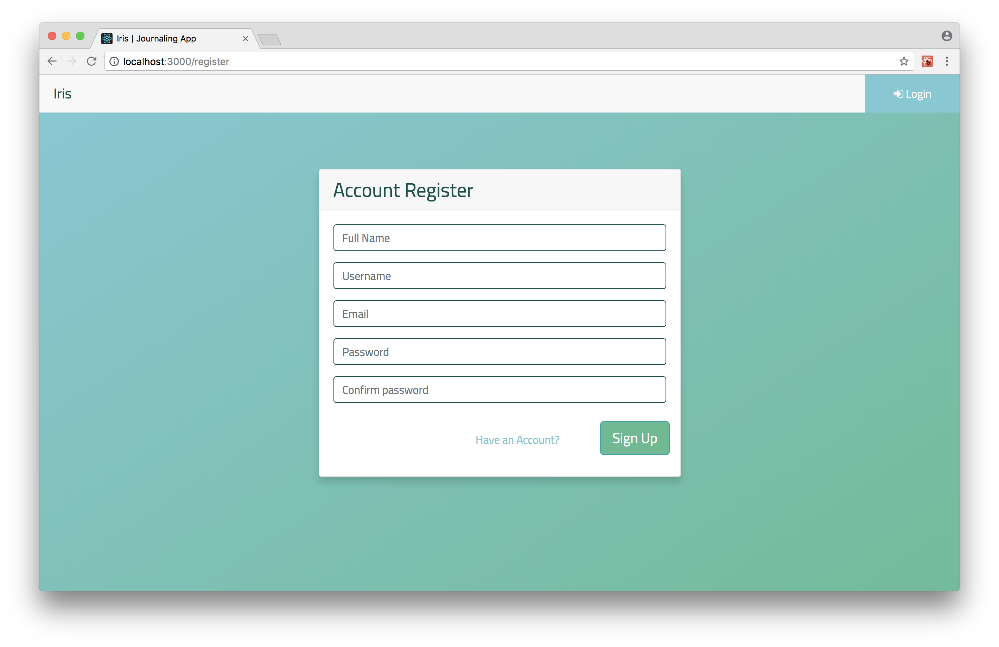
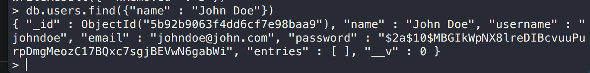
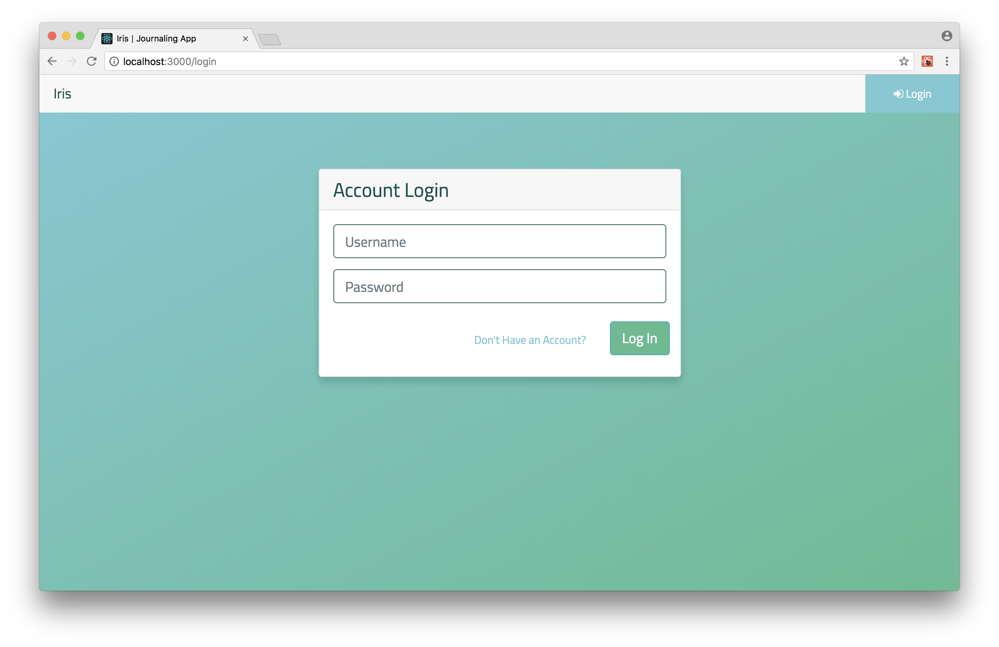
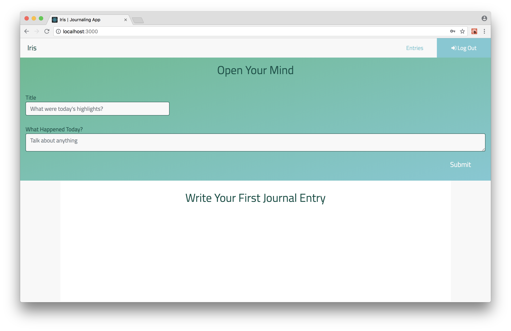
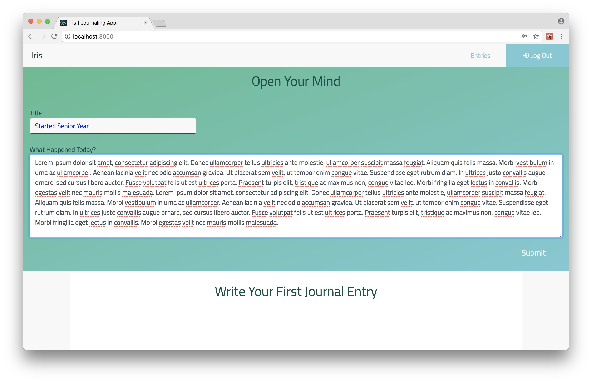
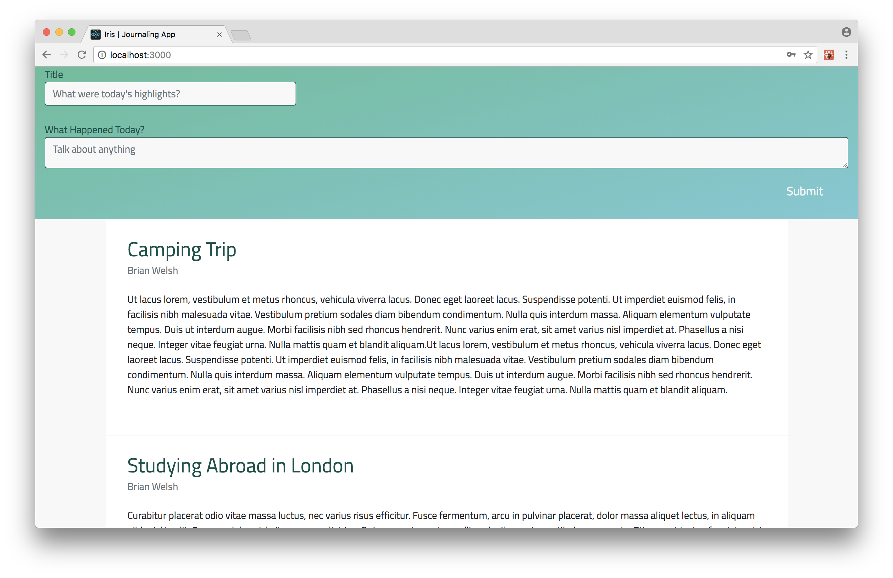
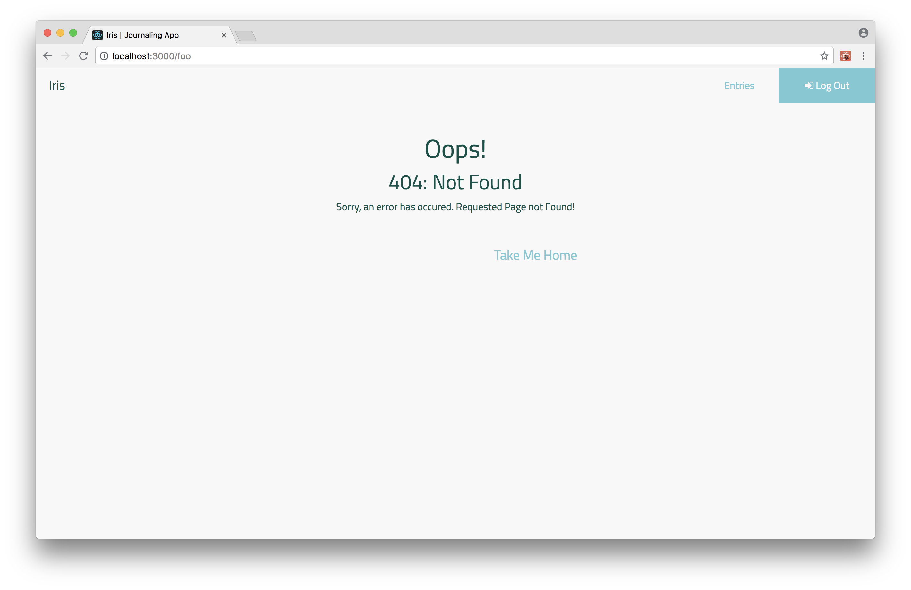

# Iris

`Open Your Mind`

## Table of Contents

- [About](#about)
- [Purpose](#purpose)
- [Prerequisites](#prerequisites)
- [Installing](#installing)
- [Technologies Used](#technologies-used)
  - [React](#react)
  - [Nodejs](#nodejs)
  - [MongoDB](#mongodb)
- [Features](#features)
  - [Register Flow](#register-flow)
  - [Login Flow](#login-flow)
  - [Add an Entry](#add-an-entry)
  - [Protected Content](#protected-content)
  - [Unused Pages](#unused-pages)
- [Iris in the Future](#iris-in-the-future)
- [React Documentation](#react-documentation)

## About

Iris is a journaling web application used to store personal entries. The app features a password protected login system to keep user data safe.

## Purpose

A problem I have with many popular journaling applications is that they are overcrowded with unnecessary features and lose support over time (as most apps do). I found myself writing my journal entries using VIM and storing them on a personal drive just to ensure they stay safe. To combat this, I decided to write my own journaling application that will have maintained support for as long as I journal.

The second purpose of Iris is for me to gain a deeper insight into modern web frameworks and learn how they interact to create a full stack application.

## Prerequisites

- `Concurrently`
- `Nodemon`

## Installing

1. Clone this Repository
2. run `npm install`
3. run `npm run dev` to concurrently run frontend and backend servers

## `npm run build`

Builds the app for production to the `build` folder. 
It correctly bundles React in production mode and optimizes the build for the best performance.

The build is minified and the filenames include the hashes. 
Your app is ready to be deployed!

See the section about [deployment](#deployment) for more information.

## Technologies Used

- ### [React](https://reactjs.org)
  - Used to build a responsive user interface. The component-based design proved to supplement my application perfectly since only one component had to update when an entry was added (as opposed to reloading the entire page).
- ### [Nodejs](https://nodejs.org/en/)
  - Used to build the backend. Node allows my application to retrieve data from the database without an I/O blocking. Express/Express-Sessions were incredibly helpful in establishing the user registration and login flow (_see Features_). Finally, express-router made API calls seamless.
- ### [MongoDB](https://www.mongodb.com)
  - Used to externally store user information. A User collection contained all information regarding a user (name, email, encrypted password, entries) and mongo allowed for quick lookup times to create, read, update, and delete operations.

## Features

- ### Register Flow

  - The Register Page displays as follow (at {site_url}/register)
    

  1. The User enters his/her information and submits their account information (after form validation).
  2. An Axios request is sent to the backend Node server which routes to User and first searches the DB for an account with that username.
  3. If it does not exist, it creates a new User (based off the defined schema) and adds the user to the users collection.
  4. Before it sends the user schema to the DB, the server executes a pre-save function that encrypts the user password using a hash function defined by bcrypt. The user object looks like the following:
     
  5. The new account is now created and the client is routed to the /login page automatically.

- ### Login Flow

  - The Login Page displays as follows (at {site_url}/login)
    

  1. The user entires his/her username and password and submits (after form validation).
  2. An Axios request is sent which calls Passport to authenticate the user. Passport searches the DB for the username, and, if found, decrypts the password and compares it with the inputted password. If both are the same, it rehashes the password and Passport serializes the user and stores it in the current session.
  3. The user is now redirected to '/'.

- ### Add an Entry

  - The homepage displays as follows (at {site_url}/)
    

  1. After the user creates a new account and signs in, they are redirected to the homepage. There, they will have the opportunity to add a new entry, or view their old ones. Since they have no entries, a message displays telling them to try adding one.
  2. The user can input the Title of the Entry and the Content of the entry and submit it.
     
  3. On submit, an Axios request sends the entry object to the node server. The server finds the username in the database then pushes the entry object to the user's entries array.
  4. The EntryList component is automatically updated and displays all of the user's entry objects in with the newest entries on top.
     
  5. Since the entry information is stored in the DB, the user can sign out and his/her entries will be maintained.

- ### Protected Content

  - When the client attempts to access the homepage ({site_url}/) and is not authenticated, React-Router redirects him/her to the Login Page. Therefore, all site content is protected.
  - Likewise, if the user IS authenticated and tries to access the login page ({site_url/login}) page or the register page({site_url/register}), the user is redirected back to the homepage (to prevent the user from signing in/registering when already authenticated).
  - Additionally, When the user signs in, their information is stored in sessions. So, if the user closes the application then reopens it a short while later, the user will be automatically signed in and redirected to the homepage which adds tremendously to the user experience.

- ### Unused Pages
  - If the user enters an invalid url (i.e. {site_url}/foo), the following page is displayed.
    
  - This allows the user to redirect to the homepage (and if not logged in, the login page)

## Iris in the Future

- Get Application hosted on a public website (potentially AWS or Heroku)
- Add Timestamp to each user Entry
- Allow the user to edit/delete his/her entries.
- Add different strategies for registering (Facebook, Google, Twitter)

## React Documentation

This project was bootstrapped with [Create React App](https://github.com/facebookincubator/create-react-app).

Below you will find some information on how to perform common tasks. 
You can find the most recent version of this guide [here](https://github.com/facebookincubator/create-react-app/blob/master/packages/react-scripts/template/README.md).
